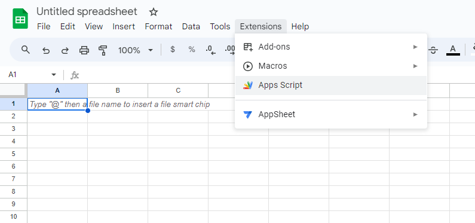

# Setup

### Prerequisites

The first row in each spreadsheet is treated as column names. E.g. let's take the following spreadsheet:

.png>)

The API for getting all rows would return the following result:

.png>)

### Installation

In your spreadsheet open _Extensions_ -> _Apps Script_.

<figure><figcaption></figcaption></figure>

\
Copy the below script to the Google Script Editor and save it.

```javascript
/*
 * SpreadAPI 1.0, created by Mateusz Zieliński
 * Home page: https://spreadapi.com
 * Sponsored by: https://roombelt.com
 * License: Apache 2.0
 */


/* 
 * Configure authentication below 
 * Learn more at docs.spreadapi.com
 */

// Admin account that has read/write access to all sheets
User("admin", "PUT_STRONG_PASSWORD_HERE", ALL);

// User account that can add entries to the "transactions" sheet
// User("user", "Passw0rd!", { transactions: POST });

// User account that can add entries to the "transactions" sheet and read from "summary"
// User("user", "Passw0rd!", { transactions: POST, summary: GET });

// Anonymous account that has write access to a specified sheet
// User("anonymous", UNSAFE(""), { transactions: POST });

// Anonymous account that has read/write access to all sheets (NOT RECOMMENDED!)
// User("anonymous", UNSAFE(""), ALL);

// Anonymous account that has read access to all sheets (NOT RECOMMENDED!)
// User("anonymous", UNSAFE(""), GET);

/*
 * Copyright 2019 Mateusz Zieliński
 * Licensed under the Apache License, Version 2.0 (the "License");
 * you may not use this file except in compliance with the License.
 * You may obtain a copy of the License at http://www.apache.org/licenses/LICENSE-2.0.
 *
 * THE SOFTWARE IS PROVIDED "AS IS", WITHOUT WARRANTY OF ANY KIND, EXPRESS OR IMPLIED,
 * INCLUDING BUT NOT LIMITED TO THE WARRANTIES OF MERCHANTABILITY, FITNESS FOR A PARTICULAR
 * PURPOSE AND NONINFRINGEMENT. IN NO EVENT SHALL THE AUTHORS OR COPYRIGHT HOLDERS BE LIABLE
 * FOR ANY CLAIM, DAMAGES OR OTHER LIABILITY, WHETHER IN AN ACTION OF CONTRACT, TORT OR OTHERWISE,
 * ARISING FROM, OUT OF OR IN CONNECTION WITH THE SOFTWARE OR THE USE OR OTHER DEALINGS IN THE SOFTWARE.
 */

/**
 * @OnlyCurrentDoc
 */
 
function doPost(request){try{var requestData=JSON.parse(request.postData.contents)}catch(e){return httpResponse(error(400,"invalid_post_payload",{payload:request.postData.contents,type:request.postData.type}))}return Array.isArray(requestData)?httpResponse(requestData.map(handleRequest)):httpResponse(handleRequest(requestData))}function handleRequest(params){const ss=SpreadsheetApp.getActiveSpreadsheet(),sheetName=(params.sheet||"").toLowerCase(),_id=null==params.id?null:+params.id,method=(params.method||"GET").toUpperCase(),key=params.key||"";if(!hasAccess(key,sheetName,method))return error(401,"unauthorized",{});if(!isStrongKey(key))return error(401,"weak_key",{message:"Authentication key should be at least 8 characters long and contain at least one lower case, upper case, number and special character. Update your password or mark it as UNSAFE. Refer to the documentation for details."});const sheet=ss.getSheetByName(sheetName);if(!sheet)return error(404,"sheet_not_found",{sheet:sheetName});if(null!=_id&&_id<=1)return error(400,"row_index_invalid",{_id:_id});const payload=params.payload;switch(method){case"GET":return null!=_id?handleGetSingleRow(sheet,_id):handleGetMultipleRows(sheet,params);case"POST":return handlePost(sheet,payload);case"PUT":return handlePut(sheet,_id,payload);case"DELETE":return handleDelete(sheet,_id);default:return error(404,"unknown_method",{method:method})}}function handleGetSingleRow(sheet,_id){const lastColumn=sheet.getLastColumn(),headers=getHeaders(sheet),result=mapRowToObject(sheet.getRange(_id,1,1,lastColumn).getValues()[0],_id,headers);return result?data(200,result):error(404,"row_not_found",{_id:_id})}function handleGetMultipleRows(sheet,params){const lastColumn=sheet.getLastColumn(),headers=getHeaders(sheet),lastRow=sheet.getLastRow(),total=Math.max(lastRow-2+1,0),limit=null!=params.limit?+params.limit:total,isAsc="string"!=typeof params.order||"desc"!==params.order.toLowerCase();if(isNaN(limit)||limit<0)return error(404,"invalid_limit",{limit:limit});var firstRowInPage=isAsc?2:lastRow-limit+1;if(null!=params.start_id){const start_id=+params.start_id;if(start_id<2||start_id>lastRow)return error(404,"start_id_out_of_range",{start_id:start_id});firstRowInPage=start_id-(isAsc?0:limit-1)}const lastRowInPage=Math.min(firstRowInPage+limit-1,lastRow);if((firstRowInPage=Math.max(firstRowInPage,2))>lastRowInPage)return data(200,[]);const rows=sheet.getRange(firstRowInPage,1,lastRowInPage-firstRowInPage+1,lastColumn).getValues().map((function(item,index){return mapRowToObject(item,firstRowInPage+index,headers)}));isAsc||rows.reverse();var next=isAsc?lastRowInPage+1:firstRowInPage-1;return(next<2||next>lastRow)&&(next=void 0),data(200,rows.filter(isTruthy),{next:next})}function handlePost(sheet,payload){const row=mapObjectToRow(payload,getHeaders(sheet));return sheet.appendRow(row),data(201)}function handlePut(sheet,_id,payload){if(null==_id)return error(400,"row_id_missing",{});const row=mapObjectToRow(payload,getHeaders(sheet));return sheet.getRange(_id,1,1,row.length).setValues([row]),data(201)}function handleDelete(sheet,_id){return sheet.getRange("$"+_id+":$"+_id).setValue(""),data(204)}function httpResponse(data){return ContentService.createTextOutput(JSON.stringify(data)).setMimeType(ContentService.MimeType.JSON)}function error(status,code,details){return{status:status,error:{code:code,details:details}}}function data(status,data,params){params=params||{};const result={status:status,data:data};for(var key in params)params.hasOwnProperty(key)&&(result[key]=params[key]);return result}function getHeaders(sheet){const headers=sheet.getRange(1,1,1,sheet.getLastColumn()).getValues()[0];for(var i=headers.length-1;i>=0;i--)if(!isEmpty(headers[i]))return headers.slice(0,i+1);return[]}function isTruthy(x){return!!x}function isEmpty(item){return""===item||null==item}function find(array,predicate){if(Array.isArray(array))for(var i=0;i<array.length;i++)if(predicate(array[i]))return array[i]}function mapObjectToRow(object,headers){return headers.map((function(column){return isEmpty(column)||void 0===object[column]?"":object[column]}))}function mapRowToObject(row,_id,headers){if(row.every(isEmpty))return null;const result={_id:_id};for(var i=0;i<headers.length;i++)isEmpty(headers[i])||(result[headers[i]]=row[i]);return result}var users;function User(name,key,permissions){users||(users=[]),users.push({name:name,key:key,permissions:permissions})}function getUserWithKey(key){return find(users,(function(x){return x.key===key||"object"==typeof x&&x.key.__unsafe===key}))}function isStrongKey(key){const strongKeyRegex=new RegExp("^(?=.*[a-z])(?=.*[A-Z])(?=.*[0-9])(?=.*[ -/:-@[-`{-~])(?=.{8,})"),user=getUserWithKey(key);return!!user&&(user.key.__unsafe===key||user.key.match(strongKeyRegex))}function getPermissions(user,spreadsheet){if(Array.isArray(user.permissions))return user.permissions;if("function"==typeof user.permissions)return user.permissions;const keys=Object.keys(user.permissions);for(var i=0;i<keys.length;i++)if(keys[i].toLowerCase()===spreadsheet.toLowerCase())return user.permissions[keys[i]];return user.permissions.ALL}function hasAccess(key,spreadsheet,method){const user=getUserWithKey(key);if(!user)return!1;const permission=getPermissions(user,spreadsheet);return!!permission&&!(permission!==ALL&&permission.toString()!==method&&!find(permission,(function(x){return x===ALL}))&&!find(permission,(function(x){return x.toString()===method})))}function GET(){}function POST(){}function PUT(){}function DELETE(){}function ALL(){}function UNSAFE(key){return{__unsafe:key}}GET.toString=function(){return"GET"},POST.toString=function(){return"POST"},PUT.toString=function(){return"PUT"},DELETE.toString=function(){return"DELETE"},ALL.toString=function(){return"*"};

```


You can find a non-minified version of the above script at [https://github.com/ziolko/spreadapi](https://github.com/ziolko/spreadapi).



Always copy SpreadAPI script from [spreadapi.roombelt.com](https://spreadapi.roombelt.com/) or [github.com/ziolko/spreadapi](https://github.com/ziolko/spreadapi). Never copy the script from other pages to ensure it has not been malformed.


### Authentication

SpreadAPI uses a custom authentication mechanism. Directly in the script, you can define multiple _Users_ with granular access levels. Each user has an _access key_ used to authenticate him while accessing the API.

#### Access key

The _access key_ should meet the following criteria:

* be at least 8 characters long
* contain at least one lower case (e.g. _a, b_, _c_)
* contain at least one upper case (e.g. _A_, _B,_ C)
* contain at least one number (e.g. _1_, _2_, _3_)
* contain at least one special character (e.g. _#, ^_ )

If you don't want to meet these criteria or need to leave the access key empty (e.g. to allow anonymous access) you can mark the password as _UNSAFE_ as shown in the example below:

```javascript
// Anonymous account that has write access to a sheet "transactions"
User("anonymous", UNSAFE(""), { transactions: POST });
```

#### Scopes

Access can be granted for each sheet and operation (_GET_, _POST, PUT_ and _DELETE)_ separately. E.g. the following configuration allows anonymous user to add entries (but not read, delete or modify) to a sheet called _transactions_ and read (but not add, modify or delete) from a sheet called _summary_.

```javascript
User("anonymous", UNSAFE(""), { transactions: POST, summary: GET });
```

You can allow more than one operation for a single sheet using the array syntax or all of them with an alias _ALL._

```javascript
// Can add new entries and remove them from "transactions"
// and do all operations on "summary"
User("user1", "Passw0rd!1", { 
    transactions: [POST, DELETE], 
    summary: ALL
});

// Can read from all sheets, but can't modify
User("user2", "Passw0rd!2", { ALL: GET });

// Can do everything in all sheets
User("user3", "Passw0rd!3", ALL);
```

### Deployment

Once you have authentication configured you can deploy the API. To do that click _Deploy_ -> _New deployment_

<figure><figcaption></figcaption></figure>

On the _New deployment_ popup select type _Web app_ and choose the following options:

* _Execute as: Me,_
* _Who has access: Anyone_

<figure><figcaption></figcaption></figure>

After clicking deploy you will be asked to grant the script authorization to your spreadsheet.&#x20;


**Note:** You grant read/write access to your spreadsheet to the script you've just created. You **don't** grant access to your data to any third-party (not even to SpreadAPI author).


<figure><figcaption></figcaption></figure>


While granting access ensure that the only required permission is _View and manage spreadsheets that this application has been installed in_ (as shown in the screenshot above).


### That's it!

After successfully deploying the script you should get its _URL_. You will use this URL to make requests to the spreadsheet API. See [usage](usage/) for details.

<figure><figcaption></figcaption></figure>
